# 113 強化學習
## 目錄
1. [基礎知識](#基礎知識)
2. [內文](#內文)
3. [圖片](#圖片)
4. [連結](#連結)
   
## 基礎知識

### 確定性策略 v.s 隨機策略
* 確定性策略：指代理人在特定狀態下只選擇一個確定的行動

因此其學習和最佳化相對簡單，通常可以使用基於梯度的方法或值迭代方法來找到優異策略

不具備探索的能力，可能會導致陷入局部優異解的問題

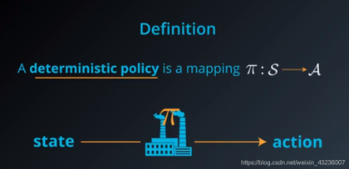
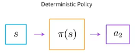

* 隨機策略：指代理人在特定狀態下以一定機率分佈來選擇行動

涉及機率分佈的選擇，其學習和最佳化相對複雜，常用的方法包括策略梯度和蒙特卡羅方法

具備一定的探索能力，可以更好地發現全局優異解

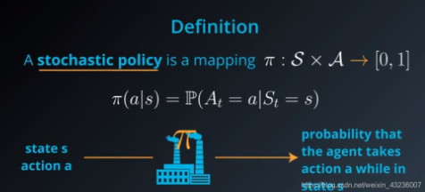
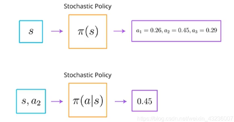
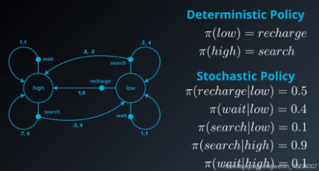

### Model-Free v.s Model-Based
* Model-Free：不依賴環境模型（狀態轉移機率和獎勵函數），直接透過與環境的互動來獲取經驗數據，並根據這些數據進行學習和最佳化

通常更容易訓練，因為具有豐富觀察值的複雜環境很難建立良好的模型。例如：自動駕駛

* Model-Based：依賴環境模型（狀態轉移機率和獎勵函數），試圖預測下一個觀察值或獎勵，選擇可能採取的最佳行動。通常會多次做出此類預測，以推估未來的每一步驟

通常適用於確定性環境，例如：具有嚴格規則的棋盤遊戲

MCTS ( AlphaGo和AlphaZero )

### Value-based RL v.s Policy-based RL
* Value-based RL：從價值函數採取出策略，是間接產生策略的方法，是確定性策略學習方法。
  
  即透過動作a和狀態s去得到一個價值Q，選擇最大Q值下a的值，這就是選取確定性策略的方法。
  
適合離散行為空間。行為數量是有限的 ( 如上下左右四個方向 )，演算法可以直接為每個行為計算和更新價值（Q值），以便找到最大化累積獎勵的行為。連續空間下較難應用，除非進行離散化處理。

演算法：sarsa、q-learning、DQN

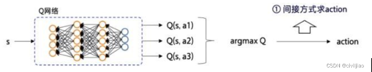

* Policy-based RL：直接產生策略的方法，是隨機性策略學習方法。具體而言，他產生的是各個動作的機率：π θ (a|s)，在策略參數θ下，狀態s選擇a動作的機率。

適用於離散和連續行為空間。特別是連續行為空間下 （如移動速度、角度通常是連續的)，策略網絡可以直接輸出連續行為的分佈（例如均值和方差），並從這些分佈中採樣行為。

演算法：policy-gradient、PPO

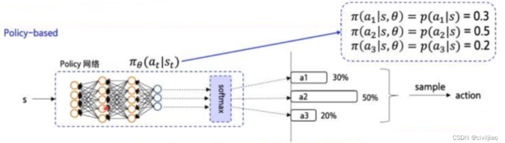

結合Value-based和Policy-based方法，創造出了經典的演員評論家（Actor-Critic、AC）演算法

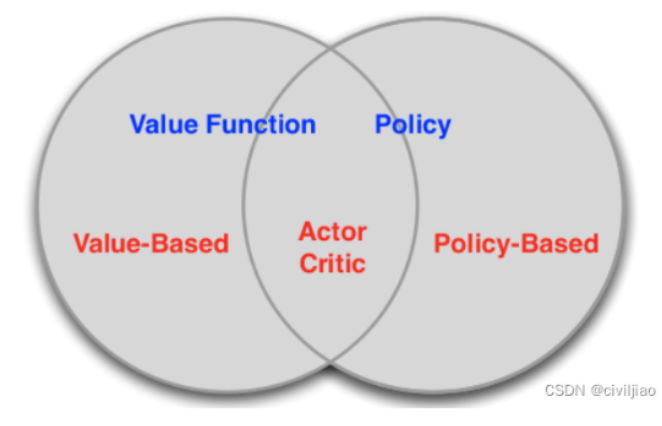

***
### 探索與利用的平衡
* ε-greedy策略

ε 範圍在 [0,1] 之間，用來控制探索的概率

代理人以機率 1-ε 選擇當前優異的行動（利用 Exploitation），以機率 ε 選擇一個隨機行動（探索 Exploration）

在實際應用中，通常會隨著時間逐步減小 ε，這樣智能體在初期可以更多地探索，而在後期逐漸專注於利用現有的知識，從而逐步逼近最優解。

* Softmax

主要作用是將一組輸入值轉換為概率分佈，且總和為1。

Sample 隨機採樣

根據這個概率分佈，從中隨機選擇一個行為。

行為A的概率是0.6，行為B是0.3，行為C是0.1，隨機抽樣會使行為A最有可能被選中，但行為B和C也有機會。

***

### On-policy v.s Off-policy
* On-policy：使用當前的策略來生成數據 ( behavior policy )，並基於這些數據來更新該策略本身 ( target policy )

換句話說，數據收集和學習都在同一個策略上進行，策略和生成數據的來源始終一致。

數據策略一致，策略收斂穩定。因為僅能利用當前策略進行探索，探索的多樣性較低，可能容易陷入局部最優解。

適合在策略需要頻繁更新的情境中使用，例如：遊戲AI

演算法：sarsa

* Off-policy：可以利用其他策略（behavior policy）生成的數據來更新自己想要學習的目標策略 ( target policy )

行為策略和目標策略可以不同，這意味著學習不必依賴當前的策略，而可以從過去的數據或探索性更強的策略中學習。

允許使用過去由其他策略（甚至隨機策略）生成的數據，或通過探索性較高的行為策略來生成更多種類的數據，數據來源較為靈活。行為策略可以與目標策略不同，允許智能體進行更多的探索，從而幫助策略接近全局最優解。但由於兩者的差異，學習過程中可能會產生估計偏差，導致學習效率較低，且算法穩定性較差。

適合需要大量探索的場景，也適合離線數據的利用，例如：醫療決策、離線推薦系統。

演算法：Q-learning、DQN

Model-Free v.s Model-Based → Policy-based RL v.s Value-based

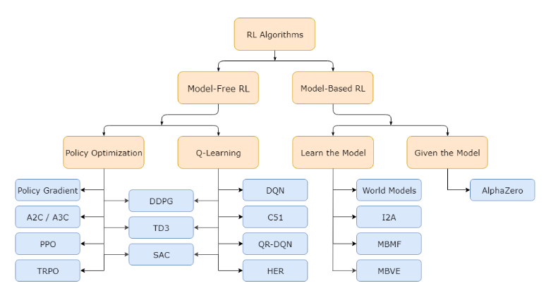

### DDQN(Off-policy) 的脈絡
* DQN
	* Q-Learning 的挑戰：透過估計 Q 值 ( 每個狀態中每個動作的預期獎勵 ) 來最大化累積獎勵的策略。雖然在較簡單的設定中有效，但在具有大型、複雜狀態空間的環境中面臨穩定性和有效性問題。
	* 概念：將 Q-Learning 與深度神經網路結合，以實現在具有高維狀態空間的環境中進行學習。
	* 關鍵創新：
   		* Off-policy：可以利用歷史資料或來自不同策略的資料進行學習。
		* 經驗回放（Experience Replay）：通過儲存代理與環境交互時的經驗，並在訓練過程中隨機從中抽取小批量樣本進行學習打破經驗之間的時間依賴性，減少連續狀態之間的相關性，來增強學習的穩定性。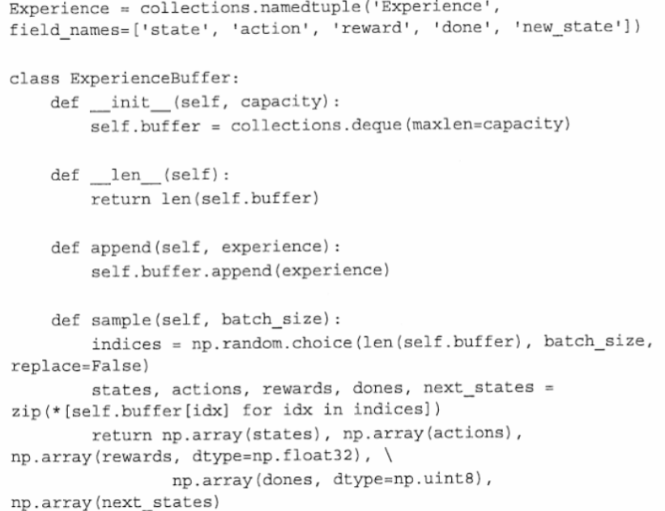

  		* 目標網路（Target Network）：單獨的目標網路結構和參數與主網路相同，但它的參數更新頻率較低。用於計算目標 Q 值，目的是增加 Q 值的穩定性。

	* 訓練過程：具體的訓練過程如下：
		1. 初始化 Reply Buffer 和 主/目標網絡
  		2. 代理與環境交互：代理在每一步中根據 ε-greedy 策略選擇 action，以一定機率進行隨機探索，以其他機率選擇當前 Q 值最大的行為。
		* 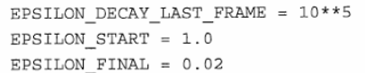
		* 訓練初期，探索（exploration）的比重極大，便於收集更豐富的環境資訊；隨著策略收斂，利用（exploitation）已知資訊的比重逐漸增加。
		3. 儲存經驗：每次與環境交互後，將經驗 (st,at,rt+1,st+1)儲存到Reply Buffer。
		4. 隨機抽樣進行訓練：
			* 從重播記憶體中隨機抽取小批量的經驗樣本。
			* 使用目標網路計算目標 Q 值：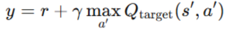
   			* 使用主網絡預測當前 Q 值 Q(s,a)。
			* 最小化損失：通過梯度下降法，將 Q 值預測誤差 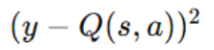作為損失函數來更新主網絡的參數。
		5. 更新目標網路：每隔一段時間，將主網絡的參數複製到目標網路中，從而保持目標 Q 值的一致性。
	* DDQN 的核心創新在於分離行為選擇和價值評估
		* 解決 DQN 過度高估的 Q 值，導致代理在更新策略時做出次優的行為選擇，從而影響收斂速度。
    		* 核心創新在於分離行為選擇和價值評估
		* 目標網路計算目標 Q 值公式改為：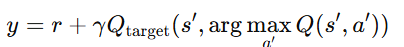
	* 結果比較：顯示儘管訓練開始時的動態相似，但雙 DQN 更快地達到了收斂。
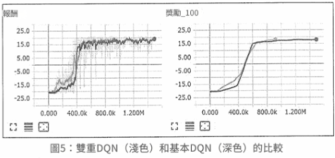
同時，帶有數值的圖表顯示， DQN 在大多數情況下都會高估動作的值。
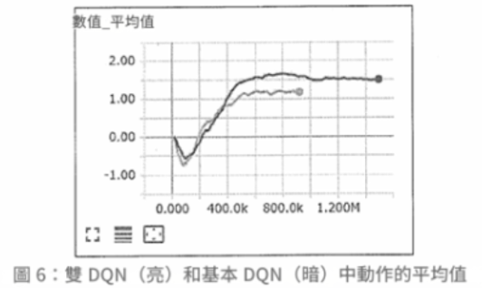

總表
https://huangwang.github.io/2020/02/10/%E7%AD%96%E7%95%A5%E6%A2%AF%E5%BA%A6%E6%96%B9%E6%B3%95%E7%AC%94%E8%AE%B0/
Value-based RL和Policy-based RL介绍和区别
https://blog.csdn.net/civiljiao/article/details/136042836?spm=1001.2101.3001.6650.4&utm_medium=distribute.pc_relevant.none-task-blog-2%7Edefault%7EBlogCommendFromBaidu%7ERate-4-136042836-blog-103371525.235%5Ev43%5Epc_blog_bottom_relevance_base8&depth_1-utm_source=distribute.pc_relevant.none-task-blog-2%7Edefault%7EBlogCommendFromBaidu%7ERate-4-136042836-blog-103371525.235%5Ev43%5Epc_blog_bottom_relevance_base8&utm_relevant_index=9
無模型（Model-Free）與有模型（Model-Based）強化學習：原理、差異與應用
https://blog.csdn.net/weixin_37410657/article/details/130484679
https://hackmd.io/@shaoeChen/Bywb8YLKS/https%3A%2F%2Fhackmd.io%2F%40shaoeChen%2FSyez2AmFr
Q-learning
https://hackmd.io/@shaoeChen/Bywb8YLKS/https%3A%2F%2Fhackmd.io%2F%40shaoeChen%2FSyqVopoYr

Deep Reinforcement Learning Hands-On: Apply Modern RL Methods, with Deep Q-networks, Value Iteration, Policy Gradients, TRPO, AlphaGo Zero and More(CH6、7)——Maxim Lapan

Deep Reinforcement Learning Hands-On: Apply Modern RL Methods, with Deep Q-networks, Value Iteration, Policy Gradients, TRPO, AlphaGo Zero and More(CH6、7)——Maxim Lapan
演算法於資產配置比較
背景知識
9/15(程式碼)

*1
1. 基於模型的強化學習 (Model Based RL)
(a) 策略迭代演算法 (Policy­Iteration)
尋找最佳策略時迭代更新策略的過程，在有限的馬可夫框架 (FiniteMDP) 下，只有有限數量的策略 (Policy)，故可在有限時間內找到最佳策略和最佳值函數 (Value Function)。

(b) 價值迭代演算法 (Value­Iteration)
可視為策略迭代演算法 (Policy­Iteration) 的簡化演算法，迭代過程中僅對值函數進行迭代更新，因找到最佳值函數等同找到最佳策略，演算法最後收斂的結果應相當於策略迭代演算法。

2. 無模型強化學習 (Model Free RL)
不對環境進行建模進而找到最優的策略，即環境的機率分布為未知下 (無母數) 進行決策。
	(a) 價值基礎之強化學習(Value­Based RL)
		DQN適用範圍還是在低維度、離散的動作空間

***將Q Learning的概念與深度學習相結合。這裡，Q函數不再是一個簡單的表格，而是通過一個深度神經網絡來逼近。神經網絡的輸入是環境的狀態s，輸出是所有可能行動的Q值。
DQN的關鍵創新是有兩個神經網絡：一個是正在訓練的網絡，另一個是固定的目標網絡，用於估計Q值更新公式中的 max𝑎′𝑄(𝑠′,𝑎′)。***

		1 .如果採用把連續動作空間離散化，動作空間則會過大，極難以收斂
		2 .只能給出一個確定性的行動 (Action)，無法給出概率值
	(b) 策略基礎之強化學習(Policy­Based RL)
考慮採用策略梯度的方法後就又引入了策略搜索的問題
i. 隨機性策略：策略輸出的是動作的概率，使用高斯分布對動作進行採樣選擇，即每個動作都有概率被選到。
ii. 確定性策略：策略輸出即是動作。

想在連續行動空間使用 Off­Policy 算法進行優化，可以概率分布中採樣得到確定性策略梯度演算法 (Deterministic Policy Gradient,DPG)，以一定的概率使用隨機策略，而在剩下的情況下使用最優行動。

3.演員評論家演算法
Actor­Critic 演算法之巧思即為讓隨機性策略 (Actor) 及確定性策略 (Critic) 彼此截長補短以實現可權衡偏差與方差的數據驅動模型

	1. 深度確定性策略梯度演算法 (Deep Deterministic Policy Gradient,DDPG)
深度學習神經網絡融合進 DPG 的策略學習方法，相對於 DPG 它改進了以卷積神經網絡作為策略函數 μ 和 Q 函數的模擬，然後使用深度學習的方法來訓練神經網絡，另外 DDPG 同樣與 DQN一樣，使用了兩種技巧,經驗重播和獨立的目標網絡。

	2. 雙延遲的確定性策略深度學習演算法 (Twin Delayed DDPG,TD3)
基礎上進一步提出三項改進方案，裁剪 Double­Q 學習 (Clipped Double­Q
Learning)、延遲策略更新 (Delayed Policy Updates) 及目標策略平滑化 (Target
Policy Smoothing)。
該文獻只簡述該方案分別解決高估 Q 值、Actor 的盲目迭代導致困在次佳解及可能出現錯誤估值 Q 引導下個錯誤策略等問題

	3. 軟性演員評論家演算法 (Soft Actor­Critic,SAC)
以 Off­Policy 的方式優化隨機性策略,它並不是 TD3 的後繼者,但它包含了裁剪 Double­Q 學習之技巧,也包含目標策略平滑的改進,
SAC 最重要的特色是熵正則化 (Entropy Regularization)，隨著訓練次數增加該策略可以最大程度的在預期收益和熵之間進行權衡
熵是策略中隨機性的一種測度，這與探索和利用的權衡關係密切，增加熵會導致更多的探索,從而可以加快之後的學習速度，它還可以防止策略過早收斂到不良的局部最佳解。
DDPG、TD3、SAC在不同市場情境下優劣
觀測值：
基本面數據使用聖路易聯邦準備數據庫 (St. Louis Federal Reserve EconomicData)市場面數據使用雅虎金融 (Yahoo Finance) 數據庫
投資標的數據使用七檔知名的美國 ETF 作為資產池供模型挑選以進行資產配置

從市場面和基本面收集來的特徵資料集，反映市場和經濟的相關資訊

*2

特徵資料的處理包括進行時間序列的資料預處理，將非定態、具自相關的數據轉換為定態且無自相關的數據。
為了確保資料具備統計獨立性及定態性，研究中使用了Durbin-Watson及Augmented Dickey-Fuller檢定方法。
目標、報酬：
獎勵函數 (Reward Function)
投資組合財富增長率最大化

*3

模型特有設定：
模型結構與參數設定對齊原始論文
1.深度確定性策略梯度演算法 (DDPG)
變更軟更新參數 (Tau)，DDPG 模型透過該參數緩慢的更新目標網路，原始論文設定該參數為 0.001，該文獻使用格點搜尋計算法 (Grid Search) 以找出適合應用於金融資產配置的參數值。
變更參數設定後，隨著訓練迭代次數增加，投資組合年化投報率(CAGR) 緩步上升，最大回撤 (MDD) 趨於穩定。

測試發現越是緩慢的更新目標網路，有提升學習穩定度效果，若不進行緩步更新，直接將 Q 網路的參數定期複製到目標網路，將使得每次訓練迭代後與目標偏離程度不斷擴大。

2.雙延遲的確定性策略深度學習演算法 (TD3)
加入了平滑正則化
在確定性策略下，目標易受到函數擬合誤差帶來的影響，進而使方差倍增，該文獻採用了 SARSA 值函數估計方法並加入正則化
其原理認為相似的動作將對應相似的函數值，因此提出在目標動作的小範圍擬合方法論，有效的減少方差以提高模型穩定度。

3.軟性演員評論家演算法 (SAC)
Reward Scale 是 SAC 特有的超參數，該參數意涵是指直接讓獎勵(Reward) 乘以一個常數(Reward Scale,k)，在不破壞獎勵函數的前提下調整獎勵值，從而間接調整 Q 值到合適的水準，∑kri = k∑ri =kQt
其中 Q 為累積收益，該文獻使用 k 為 1000，該數字是依經驗進行調整的適當水準，原論文已有論述僅需讓累計收益的範圍落在正負 1000以內即可，不需要精細調整

儘管如此它仍為本模型最關鍵的超參數，該參數越大隱含更少的 Entropy，將使得 SAC 模型漸近於 DDPG；該參數越小，將使的策略分布趨近於 Uniform，代表此將不利於探索。

結論
此比較有三個前提
第一是模型測試期間為近四年 (2017 年 4 月至 2021 年 4 月)，近四年處於長期多頭市場 (Bull Market) 區間，研究茲將此一區間分割為常態 (Normal) 期間及恐慌 (Crisis) 期間,兩期間皆經歷短期的多空市場
第二是研究盡可能的對齊原始論文的結構及參數設定
第三是本研究使用簡潔直觀的獎勵函數(投資組合財富增長率最大化)進行設計

在不同的市場波動下 (Normal 與 Crisis) 三演算法之特性 (各指標之排序) 並無顯著差異 :

*4
1.績效衡量指標 (Annualized Return，CAGR)以 DDPG 模型最佳
TD3 與 SAC 兩模型相較於 DDPG 皆對結構進行強化以增加模型穩定度及通用性，但可能因此導致模型在績效為主策略的探索上過於保守。

2.風險衡量指標 (Risk Indicator) TD3 與 SAC模型為佳
在市場波動屬常態 (Normal) 期間,TD3 模型表現最佳，
在市場波動屬恐慌(Crisis) 期間，TD3 與 SAC 表現皆名列前茅，無顯著差異，兩模型在風險為主的指標衡量上皆表現優異。

3.風險調整後績效指標 (Sharpe Ratio) DDPG 為最佳
但模型訓練時 (2007 年 3月至 2017 年 3 月)股市為急跌緩漲的特性，測試時股市為 V 型反轉，而模型使用 2007 年 3 月至 2017 年 3 月的資料進行訓練是無法學習捕捉到此以市場實務特性的轉變，故該文獻之 DDPG 模型測試結果雖為最佳，但在此必須載明此一經驗之偏誤。

[27] Lillicrap, T. P., Hunt, J. J., Pritzel, A., Heess, N., Erez, T., Tassa, Y., Silver, D., and
Wierstra, D. Continuous control with deep reinforcement learning. arXiv preprint
arXiv:1509.02971 (2015).
[16] Fujimoto, S., Hoof, H., and Meger, D. Addressing function approximation error
in actor­critic methods. In International Conference on Machine Learning (2018),
PMLR, pp. 1587–1596.
[20] Haarnoja, T., Zhou, A., Abbeel, P., and Levine, S. Soft actor­critic: Off­policy max-
imum entropy deep reinforcement learning with a stochastic actor. In International
Conference on Machine Learning (2018), PMLR, pp. 1861–1870.

應用深度強化學習演算法於資產配置優化之比較

SAC演算法實作
學習如何分配資產權重來最大化收益
資料取得
以新尖牙股為投資組合
取十年期資料(2010/1/1~2020/12/31)
日頻率
對數收益率 (log_return)
更好地處理長期投資的複合增長特性
*5
預處理
使用 ta-lib 技術分析工具包
移動平均線（MA）: 觀察價格的長期趨勢
相對強弱指數（RSI）: 資產是否超買或超賣
順勢指數（CCI）: 
價格是否偏離統計平均值，識別潛在的反轉點
平均趨向指數（ADX）:衡量趨勢的強弱
布林通道（Bollinger Bands）: 
計算價格的上下限，判斷價格是否偏離其平均值
移動平均收斂背離（MACD）: 
衡量價格的動量變化，識別趨勢反轉的信號
協方差矩陣
衡量各資產之間的收益相關性，降低風險

*6

*7
定義投資組合環境
__init__(self, data)：初始化設定
reset(self, seed=None, **kwargs)：重置環境，以便算法重新開始學習
step(self, action)：行進方式
get_obs(self)：獲取觀察值
觀察結果存於 NumPy 陣列

自定義的 PortfolioEnv 類別
模擬一個多資產投資組合的管理環境
通過觀察資產價格和調整投資比例
學習如何最大化資金餘額

*8

*9

建立與訓練
建立與訓練環境
DummyVecEnv 和 Monitor :
加入監控、支持
使環境能夠與強化學習演算法整合
訓練模型
SAC演算法進行強化學習
使用多層感知作為策略網絡
訓練時間設置為10,000個步數
*10

*11
結果分析
actor_loss 
增加，策略還在進行大規模的調整
critic_loss
增加，模型在試圖學習如何評估更複雜的情況
ent_coef (熵係數)
下降，智能體的探索行為減少
ent_coef_loss
負值表明模型的更新趨向於減少動作的隨機性

進一步優化：
增加訓練步數，讓模型在更大範圍內學習
調整熵係數或學習率，讓模型能更快找到最佳策略

*12

*13
測試模型
for _ in range(len(test_data) - 1):
迭代測試資料，模擬多個步驟的投資action
在每個回合，利用訓練好的模型進行預測，並取得投資組合的action
累積總回報

*14

*15
結果分析
Total Rewards : 0
模型未學到有效策略
Final Balance : 1000000
動作沒有實質影響：
可能是因為模型在每一步都選擇了保守的
或無效的投資組合配置
（例如：持有現金不進行投資）。

*16

*17
後續研究改進
訓練次數調整（total_timesteps）
讓模型有更多的時間學習有效的策略
變數(環境、觀測值)、回報調整
變數的增減、調整或引入更多的獎勵訊號(波動率)
模型複雜度調整
考慮增加MLP的層數或每層的神經元數量
超參數調整
調整學習率、探索率
***Reward Scale***
該參數越小，代表此將不利於探索
模型複雜度調整
考慮增加MLP的層數或每層的神經元數量

深度強化學習於投資組合管理交易策略

TDQN操作個股
12/3

基於深度強化學習（Deep Reinforcement Learning，DRL）的交易策略（TDQN），以解決股市中最佳交易決策問題，並最大化夏普比率以平衡收益與風險。

考慮的投資組合由一隻股票和代理現金組成。投資組合價值 vt 由交易代理現金價值 vc t 和股票價值 vs t 組成，後者隨著時間的推移 t 不斷變化。買賣操作只是現金和股票交換。交易代理通過訂單簿與股票市場交互，該訂單簿包含整套買單 （bids） 和賣單 （asks）。
訂單代表市場參與者的交易意願，由價格 p、數量 q 和 s（買入或賣出）組成。要進行交易需要買單和賣單之間匹配，該事件僅在
 *18
時發生。
然後，交易代理面臨著一個非常艱巨的任務，以產生利益：交易什麼、何時、如何、以什麼價格和數量進行交易。

時間軸離散化
一個連續的時間軸分割成一系列固定長度的離散時間步（時間步）的過程。
將交易時間步設為每天一次（每日一次決策），即Δt = 1天。
簡化交易決策模型
限制交易頻率，減少高頻交易所產生的成本
提供足夠的市場變化數據提供模型學習。

交易策略
更新可用的市場資訊
執行策略以採取行動
執行指定交易行動
下次步驟為 t +1 ，迴圈回到步驟 1
*19

最優策略、獎勵函數
折扣因子決定了未來獎勵的重要性。若為0則代理只考慮當前的獎勵，而完全丟棄未來的獎勵。當貼現因子增加時，代理往往會變得更加注重長期。參數應根據所需的行為進行調整。
*20
*21
*22

變數
使用歷史股市日內 HLCV 資料（High-Low-Close-Volume），內部狀態
*23

行動
代理必須回答幾個問題：是否交易、如何交易以及交易多少？
= 在時間步驟 t 購買的股票數量 ( Qt )
at = Qt
可能會出現三種情況：
Qt >0： 代理發佈新的出價訂單購買股票
Qt <0： 代理發佈新的賣單來出售股票
Qt =0： 代理持有不買賣任何股票

行動對內部環境的影響
現金價值更新
*24
股票價值更新
*25
行動空間約束——動作上、下界
現金限制：代理不能買入超過現有現金可支付的股票數量
*26
風險限制：代理持有空頭時需保證其現金足以應對股價波動帶來的風險
*27
*28
*29
檢查是否有足夠的資金回補
有足夠資金 (delta<0)
條件：lowerBound <= 0 表示有足夠資金支持當前的賣空
操作：保持現金餘額（Cash）不變、更新持有價值（Holdings）

無足夠資金，需先進行回補 (delta>=0)
條件：lowerBound > 0 表示資金不足以維持當前賣空，需要回補部分空頭。
操作：計算需要回補的股數：
math.floor(lowerBound)：能根據資金回補的最大股數。
self.numberOfShares：當前賣空的總股數。
回補股數取兩者的較小值
更新剩餘賣空：減去已回補的股數，更新剩餘的賣空股數。
更新現金餘額：現金減去回補股數的成本（包含交易成本）。
更新持有價值：根據剩餘賣空股數和當前收盤價更新持有價值。

*30
*31

*32
簡化動作空間
賣空：賣出持有部分來清空持倉，並額外進一步賣空等量股票；現金限制下的額外賣空
*33
*34
*35
樣本期間
訓練集：2012 年 1 月 1 日至 2017 年 12 月 31 日
測試集：2018 年 1 月 1 日至 2019 年 12 月 31 日
頻率
日內交易，每日做出交易決策測試資料
提出一個由 30 隻股票組成的測試平台，呈現不同的特徵（行業、地區、波動性、流動性等）

*36

研究結果
基準策略：
買進並持有
賣出並持有
移動平均線追蹤趨勢 （TF）
*37
均值回歸與移動平均線 （MR）
*38
良好表現的案例：Apple 
*39
抓住主要趨勢：TDQN 能夠準確檢測市場中的主要趨勢並從中獲益，例如在價格穩
定上漲或下跌時執行相應的買入或賣出操作。
反應性和前瞻性：對趨勢表現出反應性，但在某些高波動時期，代理能根據市場信號（如波動性增加）預測趨勢反轉。
表現受限的案例：Tesla 

*40
主要挑戰——高波動性：Tesla 股票具有顯著的高波動性，增加了交易策略的難度。同時增加的交易頻率導致更高的交易成本和風險。
交易頻率：過於頻繁的交易是導致績效降低的主要原因，顯示 TDQN 在高波動市場中的限制。
測試集上的表現明顯低於訓練集

整體表現
*41
基準策略的表現：
Buy and Hold表現在大多數情況下優於其他基準策略，這與測試期間市場多為牛市有關。
均值回歸、趨勢追蹤表現不佳，特別是在多樣化市場特性中缺乏適應性。
TDQN 的適應能力：與傳統策略相比，TDQN 的主要優勢在於能同時處理多種市場模式，具備更高的靈活性和泛化能力。

重要因子
折扣因子須因所處市場而調適
高 𝛾 適用於穩定市場：模型可能誤判某些短期波動是長期趨勢的開始，代理為不錯過未來回報導致頻繁交易，增加交易成本。
低 𝛾 適用於不穩定市場：過於關注於當下回報，可能錯過長期最大化收益。
交易成本
交易成本越高會使回報減少，進而減少交易頻率。
短期價格波動包含許多噪聲（隨機性），這些噪聲並不反映實際的市場趨勢，高頻交易減少有助於收益增加。
*42
An Application of Deep Reinforcement Learning to Algorithmic Trading
DRIP 深度強化學習 + 社會責任投資（SRI）
一個名為 Deep Responsible Investment Portfolio (DRIP) 的模型，該模型利用深度學習技術和強化學習方法來優化社會責任投資（SRI）組合。在傳統投資組合模型中，財務回報和風險控制是主要考量因素，而DRIP模型同時考慮財務回報和環境、社會、治理（ESG）評分，提供一個兼顧財務績效和社會責任的投資組合優化方案。
資料集：
資料來源：
資料來源包括公司社會責任（CSR）報告、ESG評分、股票歷史價格、財務新聞等數據。
ESG評分來自於公司公佈的環境、社會與治理（ESG）相關的報告和新聞資料，如碳排放、廢棄物管理、員工健康與安全、董事會透明度等。
資料處理：
使用多變量雙向長短期記憶（BiLSTM）神經網絡來處理股價和ESG評分的多變量時間序列預測
不進行數據標準化，直接使用股票的實際回報數據進行模型訓練，避免未來數據範圍的「泄露」。

如果進行標準化處理，特別是針對時間序列數據，模型可能在訓練過程中「學習」到未來數據的範圍。這會導致模型在測試或預測階段表現得不準確，因為模型已經利用了未來信息，這不符合實際市場中預測未來的需求。
使用滑動窗口技術進行滾動預測，將歷史股價資料分割成固定大小的窗口，用於預測未來的股票回報。
滑動窗口技術的概念
滑動窗口技術的基本思路是將時間序列數據（如股票價格）分成固定大小的子集（稱為窗口），並使用這些子集進行模型訓練和未來預測。這種方法可以捕捉到時間序列數據中的短期變化和趨勢，對於金融市場的高波動性特別有效。
具體實施步驟
選擇窗口大小：
首先確定滑動窗口的大小（即時間步數），例如可以選擇5天、10天、30天等。窗口大小的選擇會影響模型的性能，通常需要根據具體的數據特徵和預測需求進行調整。
創建窗口：
將歷史股價資料按時間順序切割成多個固定大小的窗口。例如，對於一個包含100天股價數據的序列，若窗口大小為10，則可以生成的窗口如下：
窗口1：第1天到第10天
窗口2：第2天到第11天
窗口3：第3天到第12天
以此類推，直到第91天到第100天的窗口。
訓練模型：
對於每個窗口，使用該窗口中的數據來訓練預測模型（如LSTM、BiLSTM等）。每個窗口都將作為一次訓練的輸入，以學習過去數據的模式。
進行預測：
使用每個訓練好的模型來預測下一個時間步的股價。例如，若窗口包含第1天到第10天的數據，則預測第11天的股價。
滑動窗口：
當預測完成後，窗口向前滑動一個時間步，然後使用新的窗口數據進行下一次預測。例如，窗口從第2天到第11天的數據進行訓練，預測第12天的股價。
重複進行：
重複以上步驟，直到處理完所有可用的歷史數據。
優點
捕捉短期趨勢：滑動窗口技術能夠捕捉到數據中的短期變化，適合處理股價的高波動性。
靈活性：可以根據不同的時間尺度調整窗口大小，以適應不同的預測需求。
增加數據量：將長時間序列分割成多個窗口，能夠生成更多的訓練樣本，提高模型的泛化能力。
挑戰
計算負擔：隨著窗口的增加，訓練模型所需的計算資源也會增加。
窗口大小的選擇：選擇不合適的窗口大小可能會導致模型性能下降，過小可能無法捕捉長期趨勢，過大則可能會掩蓋短期變化。
比較了 LSTM 和門控循環單元(GRU) 網路等不同 RNN 架構的效能 。建議在類似的序列預測問題中，雙向 LSTM可能是更好的選擇 [8]。雖然具有單向資訊流的 LSTM 和 GRU 可能足以解決大多數序列預測問題，但 BiLSTM 模型會向後讀取一次數據這有助於提高預測準確性，特別是在預測金融時間序列等連續資料時。 

*43
LSTM 是 RNN 的一種。因為其可以接受序列資料、多個輸入、有記憶這些特點，非常適合用來處理文本資料。
「雙向」LSTM。也就是說，在一個序列的輸入中，BiLSTM 能夠同時編碼由前至後的訊息和由後至前的訊息。
這種能力在文本或情緒的分析時是非常有用的。假設有個句子是：「今天晚上的＿＿＿＿＿很好聽，令人回味無窮。」若是只從前向推測，可能的候選就非常多，有晚餐、聚會、音樂會、月亮......然而，若將後向的編碼考慮進來，在以上的選項中就只有「音樂會」是最有可能的，顯而易見，範圍縮小了許多。
TF Keras Tutorial - Bi LSTM, Glove, GRU
Next Word Prediction BI-LSTM tutorial easy way
https://ithelp.ithome.com.tw/articles/10298511

變數：
	價格數據：包含股價、ESG評分、波動率等，這些變數用於預測未來的股票回報並優化投資組合。
股價資料用來進行時間序列預測，ESG評分用於投資組合的多目標優化，權衡財務回報與社會責任。
狀態空間（State Space）：包含帳戶餘額、股票持有數量、股票價格、技術指標等。
動作空間（Action Space）：包括買、賣或持有股票的操作，動作可以表示為買賣不同數量的股票。
獎勵函數（Reward Function）：
獎勵函數同時考慮投資組合的財務回報和ESG評分：
財務回報部分基於投資組合價值的增長。
ESG獎勵部分基於組合中公司ESG評分的加權平均。
總獎勵函數是一個多目標函數，平衡回報和ESG表現。
研究結果：
DRIP模型經過30年的100隻股票數據測試，顯示其在財務回報和社會責任方面均優於傳統的投資組合模型。與僅考慮財務回報的模型相比，DRIP能夠同時實現高ESG評分和穩定的財務增長，為投資者提供了一個更符合現代社會責任需求的投資方案。
結論：
DRIP模型通過結合多變量BiLSTM和深度強化學習，成功優化了社會責任投資組合，解決了傳統投資組合優化模型無法同時處理財務回報與社會責任問題的局限。未來的研究可以探索該模型在不同市場或資產類別上的應用，並進一步加強ESG評分的影響，幫助投資者在可持續發展與財務回報間取得平衡。
Deep learning for decision making and the optimization of socially responsible investments and portfolio
深度強化學習庫
10/15
一個名為FinRL的開源深度強化學習庫，專門用於自動化股票交易策略。此庫提供了多種 DRL 算法和交易環境，幫助使用者簡化開發過程，並通過回測來評估策略性能。
https://github.com/AI4Finance-Foundation

資料集：
資料來源：
FinRL 使用來自六大股票指數的歷史市場數據，包括 NASDAQ-100、道瓊工業指數（DJIA）、標普500（S&P 500）、恆生指數（HSI）、滬深300（CSI 300）等。
	資料處理：
基於 OpenAI Gym 框架模擬金融市場環境。資料包括日間數據、每小時數據和分鐘數據，並通過技術指標（如移動平均線、相對強弱指數）進行強化學習模型的訓練。資料被組織成時間序列。
	變數：
價格數據：開盤價、收盤價、最高價、最低價等，用於追蹤市場波動。
技術指標：MACD（移動平均線收斂/發散指標）、RSI（相對強弱指數）等，用於捕捉市場的技術趨勢。
狀態空間（State Space）：包含帳戶餘額、股票持有數量、股票價格、技術指標等。
動作空間（Action Space）：包括買、賣或持有股票的操作，動作可以表示為買賣不同數量的股票。
獎勵函數（Reward Function）：如投資組合價值變化、投資組合日誌回報率、夏普比率等，來評估每個交易決策的效果。

研究結果：
研究展示了FinRL在多種應用場景下的效果，包括單隻股票交易、多隻股票交易以及投資組合配置。FinRL庫集成了多種DRL算法，如 DQN、DDPG、PPO、SAC、A2C 和 TD3 等。實驗結果表明，該庫能夠有效地模擬真實市場條件，並幫助用戶設計出穩健的自動化交易策略。

結論：
FinRL為量化金融提供一個靈活且易於上手的開源工具，能幫助初學者和研究人員快速開發和測試自動化股票交易策略。該工具的模塊化設計和標準化交易環境簡化強化學習在金融應用中的複雜性，促進研究和實踐中的策略比較與調整。未來可以擴展FinRL至更多資產類別（如期貨、債券等）以及更加複雜的市場條件，並進一步優化風險管理和交易成本的考量。

*********************************************************************************************************
基於OpenAI Gym框架構建的交易模擬環境 
主要是用來模擬真實的金融市場環境，讓強化學習代理（DRL agents）可以在這樣的環境中學習、訓練並進行決策

1. 三層架構：環境層、代理層和應用層
FinRL 的架構分為三層：

環境層：模擬金融市場環境，提供真實的市場數據，並基於時間推進進行模擬交易。
代理層：包括多種深度強化學習（DRL）算法，這些代理負責根據當前的市場狀態進行買賣決策。
應用層：包含具體的交易應用，如單隻股票交易、多隻股票交易和投資組合配置。
*44
金融市場環境的模擬
在OpenAI Gym框架下，FinRL 將金融市場模擬成一個馬爾可夫決策過程（MDP），該過程有以下核心組成部分：
*45
狀態空間（State Space）
狀態空間定義了交易代理能夠觀察到的市場信息。這些信息用於幫助代理了解當前市場狀況，做出決策。包括：
賬戶餘額：賬戶當前的現金餘額。
持有股票數量：代理當前擁有的每隻股票的數量。
股價：股票的開盤價、最高價、最低價和收盤價。
技術指標：例如移動平均線（MACD）、相對強弱指數（RSI）等。
成交量：每隻股票的成交量。
行為空間（Action Space）
行為空間定義了代理在每個時間步驟中可以做出的行為選擇。這些行為包括：
買入：買入某隻股票。
賣出：賣出某隻股票。
持有：保持現有倉位不變。 行為還可以具體化為買賣的股票數量，如 "買入10股AAPL" 或 "賣出10股AAPL"。
獎勵函數（Reward Function）
獎勵函數是代理學習的核心，指引代理做出有利於最大化長期回報的行為。常見的獎勵函數包括：
投資組合價值變化：根據行動前後投資組合的價值變化來計算獎勵。
對數回報率：計算投資組合的對數回報率。
夏普比率：將回報標準化為風險調整後的度量（如 $S_T = \frac{mean(R_t)}{std(R_t)}$）。
時間驅動的模擬
該環境基於時間推進進行模擬，根據預設的時間粒度（如天、時、分鐘）來模擬股票交易過程。代理每隔一個時間步驟觀察市場數據，然後做出決策。此過程會持續直到模擬結束。
模塊化設計
每層架構都設計為模塊化，允許用戶選擇特定的模塊進行交易任務的定制。例如，用戶可以在代理層選擇不同的DRL算法（如DQN、DDPG、PPO等），或在環境層選擇不同的市場數據集來進行回測。
資料集與市場環境
FinRL 提供了標準的市場數據集來模擬不同的交易環境，這些數據集包括NASDAQ-100、道瓊工業指數、標普500、恒生指數、滬深300等。這些資料集被預處理為符合模擬需求的格式，如每天、每小時或每分鐘的價格和交易量數據，代理在這些資料集上進行訓練和測試。
市場摩擦的處理
FinRL環境中還加入了真實市場中的摩擦因素，如：
交易成本：每次交易會扣除一定比例的手續費。
市場流動性：考慮市場流動性對價格波動的影響。
在代理進行買賣決策時，可以根據市場交易量和代理的交易量來動態調整實際執行價格。例如，當代理執行大量買入操作時，股價會隨著流動性的減少而上漲，導致代理以更高價格買入。
風險厭惡程度：允許代理根據投資者的風險偏好進行決策調整。
在獎勵函數中加入風險調整的參數。風險厭惡程度可以通過風險調整後的回報（如夏普比率）來實現，這樣代理會根據風險厭惡參數進行權衡，最大化風險調整後的收益而非僅僅是絕對收益。
FinRL: A Deep Reinforcement Learning Library for Automated Stock Trading in Quantitative Finance
景氣循環與資產配置
12/17
研究工具與方法：
採用頻譜分析（Spectral Analysis）檢視景氣循環與資產價格的循環
使用Baxter-King與Christiano-Fitzgerald濾波器分離經濟時間序列中的不同頻率訊號
主要發現：
市場的循環行為：
債券、股票、商品市場與景氣循環的週期長度均在3.5至7.5年之間。
這些市場提出了顯著的領先與落後的關係：
景氣循環領先於商品市場，卻落後於債券與股票市場。
*46
債券市場又領先商品市場。
基金的循環特性：
不同種類的基金（如債券型、科技型）都存在類似的循環現象
基金間有三組領先或落後關係：
基金債券型基金領先股票型，股票型基金領先能源型基金
貨幣型基金領先地產型基金
經濟大蕭條與金融海嘯：
Kitchin、Juglar及Kuznets循環同時 進入收縮期是造成1930年經濟大蕭條以及2008年全球金融海嘯的共同原因之一
應該在經濟達到低谷之前增加股票放空，然後在經濟達到頂峰之前轉向商品資產，然後在經濟衰退的大部分時間里轉向債券。
只有股票和債券的策略類似於 Siegel （1991），他已經表明，在商業周期的轉捩點之前，通過在債券和股票之間切換，可以顯著提高投資組合的回報。
股票、債券、大宗商品
Bennchmark:擴張時股票，衰退時債券
在商業週期高峰期前 6 個月轉向大宗商品，然後在峰值後 2 個月轉向債券，然後在低谷前 6 個月轉向債券的平均回報率。
景氣循環四個階段與資產表現
復甦期 (Recovery)
表現最佳：股票市場(利率低，企業獲利改善，推升股市上漲)
表現較弱：商品市場(投資需求尚未完全恢復，商品市場仍疲弱)
其他：債券市場(利率低支撐債券價格，但表現開始趨於平穩)
擴張期 (Expansion)
表現最佳：股票市場(經濟增長加速，企業利潤擴大，股市持續走強)
表現較強：商品市場(需求增加推高商品價格)
表現較弱：債券市場(利率上升，壓制債券表現)
減速期 (Slowdown)
表現最佳：商品市場(通脹壓力上升，商品價格仍強勁)
表現較弱：股票市場(經濟增長放緩，利潤縮減，股市轉弱)
其他：債券市場(隨著經濟減速和利率下降，債券市場表現逐漸好轉)
衰退期 (Recession)
表現最佳：債券市場(利率下降，推升債券價格)
表現較強：股票市場（接近底部時開始回升）投資者對經濟復甦的預期提升股市表現。
表現較弱：商品市場(經濟活動低迷，需求減弱，壓制商品價格)

資產配置策略建議
復甦期 (Recovery)
增加股票配置、保持債券配置、避免配置商品
擴張期 (Expansion)
保持股票高配置、逐步增加商品配置、減少債券配置
減速期 (Slowdown)
轉向商品市場、減少股票配置、適度增加債券配置
衰退期 (Recession)
增加債券配置、適度增持股票、減少商品配置*47
景氣循環、通貨膨脹衡量及聯邦資金利率期貨三論

